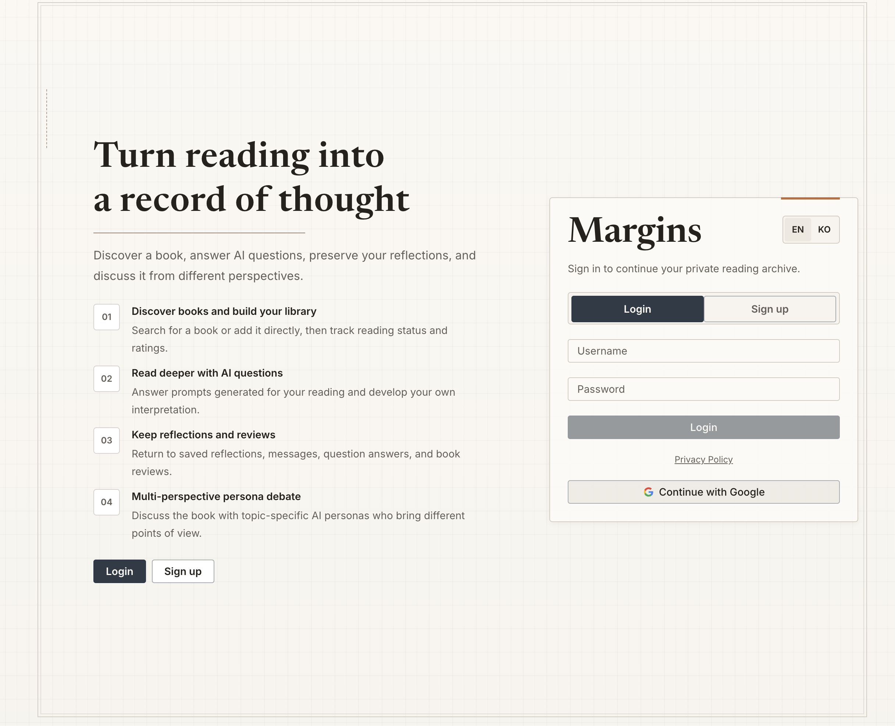
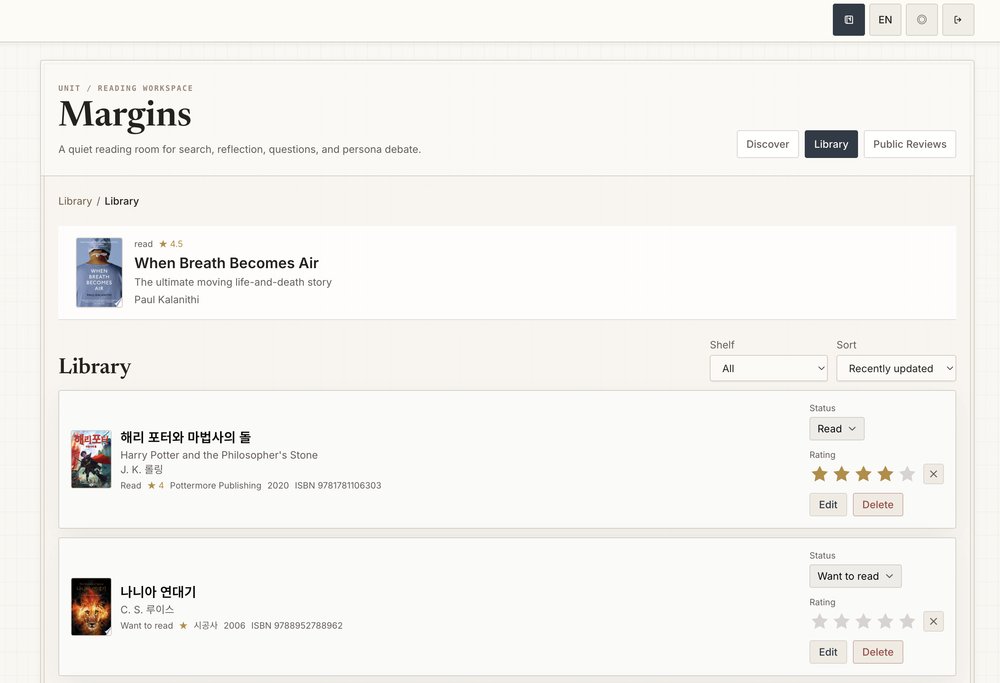
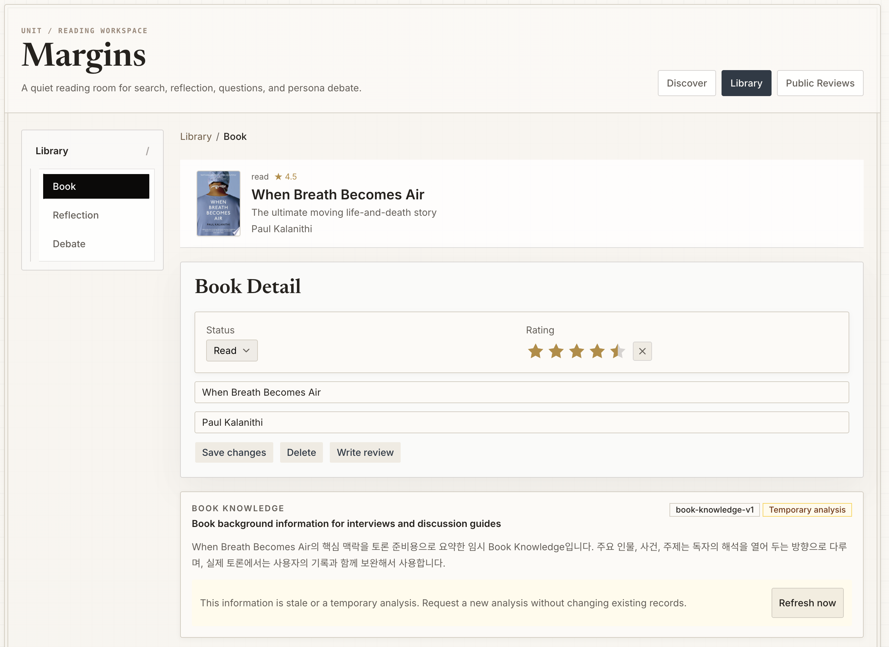
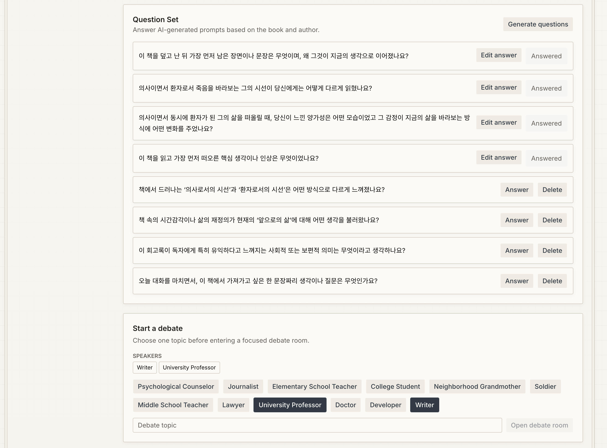
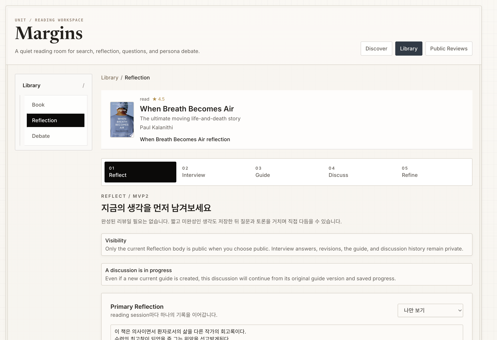
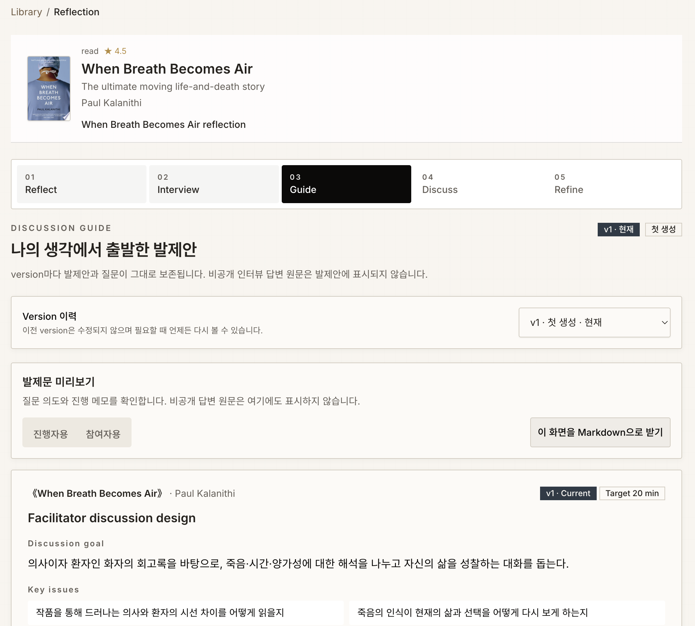
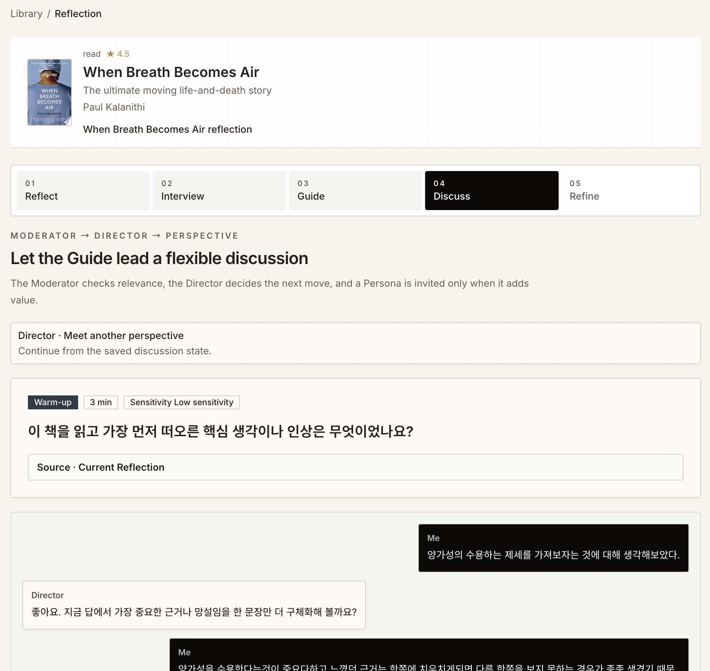
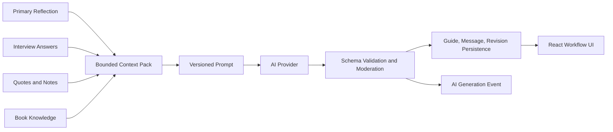
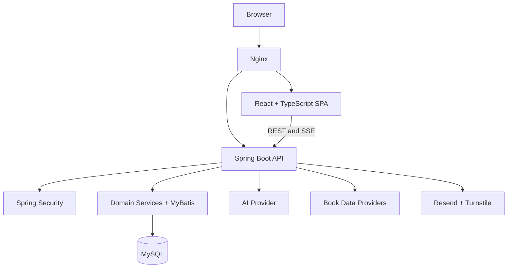

# Margins

> 생각의 변화를 기록하는 AI 보조 독서 토론 플랫폼

Margins는 책을 발견하고 기록한 뒤, AI 질문과 여러 관점의 페르소나 토론을 통해 독서를 확장하는 풀스택 웹 애플리케이션입니다. AI가 독후감을 대신 작성하는 대신, 사용자가 남긴 Reflection과 답변을 근거로 다시 질문하고 생각을 발전시키도록 설계했습니다.

**Live Demo:** [https://margins.cloud](https://margins.cloud)

## Product walkthrough

### 01. 인증과 개인 독서 공간



- 사용자 행동: 계정 또는 Google OAuth로 개인 독서 공간에 진입합니다.
- 시스템 동작: Spring Security 기반 인증, JWT access token과 HttpOnly refresh cookie를 사용합니다.
- 기술 포인트: 이메일 인증, Cloudflare Turnstile, 가입 intent와 개인정보 동의 상태를 하나의 가입 흐름으로 검증합니다.

### 02. 서재와 독서 상태 관리



- 사용자 행동: 책을 검색하거나 직접 등록하고, 읽기 상태와 별점을 관리합니다.
- 시스템 동작: React Query가 서버 상태를 동기화하고 MySQL이 사용자별 서재 상태를 보존합니다.
- 기술 포인트: 외부 도서 검색 결과와 사용자가 저장한 도서 레코드를 분리해 외부 API 실패가 개인 기록에 영향을 주지 않도록 구성했습니다.

### 03. Book Knowledge와 독서 맥락



- 사용자 행동: 책의 기본 정보와 독서 상태를 확인하고 Reflection 작성을 시작합니다.
- 시스템 동작: Book Knowledge는 인터뷰와 발제안 생성에 사용할 배경정보를 별도 lifecycle로 관리합니다.
- 기술 포인트: 분석 freshness와 provider 상태를 명시해 오래되거나 임시인 AI 분석이 기존 기록을 조용히 덮어쓰지 않도록 했습니다.

### 04. 빠른 AI 질문과 자유 토론



- 사용자 행동: 책과 저자를 바탕으로 생성된 질문에 답하고, 원하는 관점의 Persona를 선택해 토론을 시작합니다.
- 시스템 동작: 질문·답변과 토론방을 독서 session에 연결해 새로고침 후에도 이어서 사용할 수 있습니다.
- 기술 포인트: 질문 생성과 Persona 응답을 backend provider boundary 뒤에 두어 UI와 모델 SDK를 분리했습니다.

### 05. Reflection Loop



- 사용자 행동: `Reflect → Interview → Guide → Discuss → Refine`의 다섯 단계로 생각을 구체화합니다.
- 시스템 동작: 최초 Reflection, 인터뷰 답변, 발제안과 수정본을 서로 다른 versioned record로 보존합니다.
- 기술 포인트: 공개 여부는 현재 Reflection 본문에만 적용하고, 인터뷰 답변·발제안·토론 기록은 비공개로 유지합니다.

### 06. 근거 기반 Discussion Guide



- 사용자 행동: 자신의 기록에서 출발한 발제안과 토론 질문을 확인하고 버전을 선택합니다.
- 시스템 동작: Reflection, Interview, 인용문·메모와 Book Knowledge를 bounded evidence로 구성해 AI 발제안을 생성합니다.
- 기술 포인트: prompt version, guide version과 AI generation event를 함께 기록해 생성 결과의 재현성과 운영 관찰 가능성을 확보했습니다.

### 07. Moderator, Director, Persona 토론



- 사용자 행동: 발제안을 따라 AI와 대화하고, 필요한 순간에만 다른 Persona의 관점을 요청합니다.
- 시스템 동작: Moderator가 주제 적합성을 판단하고, Director가 다음 진행을 결정하며, Persona는 실제 가치가 있을 때만 호출됩니다.
- 기술 포인트: moderation decision, 대화 message, 사용된 guide version과 최종 refinement를 영속화해 중단 후에도 같은 상태에서 재개합니다.

## Product AI architecture

Margins의 AI 기능은 자유 대화형 chatbot보다 사용자의 기록을 보존하고 발전시키는 domain workflow에 가깝습니다.



- 원문과 AI 생성 결과를 분리해 저장합니다.
- 동일한 Reflection에서 만들어진 guide와 discussion은 사용된 source revision을 유지합니다.
- provider 실패를 저장 성공으로 표시하지 않고 명시적인 fallback과 오류 상태로 전달합니다.
- 생성 model, prompt version, token usage와 성공·실패 결과를 관찰 가능한 event로 기록합니다.

## Full-stack architecture



| Layer | Responsibilities | Main technologies |
| --- | --- | --- |
| Frontend | 사용자 workflow, 서버 상태, 인증 session, streaming UI | React, TypeScript, TanStack Query, Zustand, Vite |
| Backend | 인증, domain orchestration, AI provider boundary, validation | Java 21, Spring Boot, Spring Security, MyBatis |
| Database | versioned reflection, discussion state, audit event, migration | MySQL, versioned SQL migration |
| Runtime | TLS entry point, reverse proxy, service lifecycle, backup·smoke check | Ubuntu, Raspberry Pi, Nginx, systemd, Docker |

## AI Native development

제품의 AI 기능뿐 아니라 개발 workflow도 역할이 분리된 AI Agent 환경으로 구성했습니다.

```text
Product Owner  → 목표, 우선순위, 최종 승인
PM Agent       → 요구사항과 acceptance criteria 정리
Developer Agent→ 구현, 테스트, PR
Reviewer Agent → 독립 리뷰, 회귀 검증, 수정 요구
```

Slack은 대화형 gateway, Kanban과 GitHub Issue/PR은 durable work state로 사용했습니다. 요구사항, architecture boundary, acceptance criteria와 최종 merge·배포 판단은 개발자가 소유하고, Agent는 명시된 역할과 권한 안에서 구현과 검증을 수행하도록 설계했습니다.

## Repository structure

- `front/`: React application, feature modules, unit/component/E2E tests
- `back/`: Spring Boot API, domain services, security and provider adapters
- `db/`: MySQL schema, query, deterministic local/E2E fixtures
- `docs/architecture.md`: 공개용 architecture overview
- `.github/workflows/ci.yml`: 공개 mirror용 최소 CI

이 저장소는 포트폴리오 검토를 위해 정리한 공개 스냅샷입니다. 비공개 원본의 Git 이력, 운영 credential·host 설정, 내부 작업 기록과 배포 runbook은 포함하지 않습니다.

## Rights

이 공개본은 현재 오픈소스 배포물이 아닙니다. 별도 라이선스가 부여될 때까지 코드와 문서의 권리는 `COPYRIGHT.md`를 따릅니다. 화면에 표시된 도서 표지와 메타데이터의 권리는 각 저작권자와 외부 데이터 제공자에게 있습니다.
